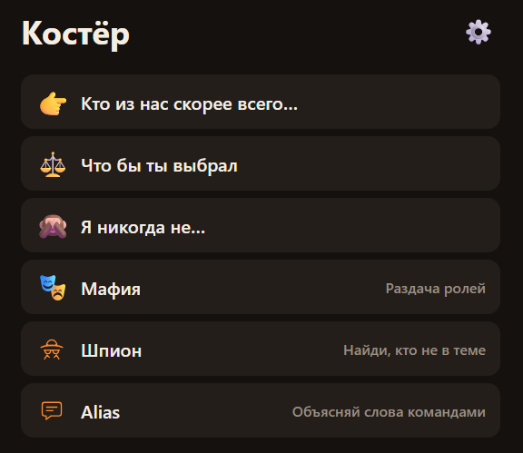

# Костёр

Офлайн-приложение с играми для компании: для вечеринки, похода, поездки или семейного вечера. Один телефон на всех, без регистрации и интернета (после первого открытия). Русский и английский.

**Играть:** https://koster-779.pages.dev

## Как играть

- **Карточки с вопросами.** Выберите колоду: «Кто из нас скорее всего…», «Что бы ты выбрал», «Я никогда не…» и другие. Читайте вопрос вслух, все отвечают, а свайп открывает следующий. Приложение запоминает, где вы остановились в каждой колоде.
- **Мафия.** Задайте число игроков и роли, потом передавайте телефон по кругу: каждый тайком смотрит свою роль. Дальше ведущий проводит игру как обычно.
- **Шпион.** Все, кроме шпиона, получают одно и то же слово, шпион знает только тему. Передайте телефон по кругу и запускайте таймер: игроки задают друг другу вопросы и ищут шпиона, а шпион пытается угадать слово.
- **Alias.** Разбейтесь на команды. Объясняющий видит слово на экране и объясняет его своей команде, не называя: свайп вверх, если угадали, вниз, если пропускаете. За ход даётся ограниченное время. Побеждает команда, которая первой наберёт нужное число очков.
- **Данетки.** Ведущий читает вслух загадочную историю, а ответ смотрит тайком: он спрятан под рубашкой и открывается по тапу. Остальные задают вопросы, на которые можно ответить только «да» или «нет», и докапываются до разгадки. Разгаданные истории не повторяются, мрачные включаются отдельным переключателем. Пока только на русском.

Чтобы играть без сети, один раз откройте приложение с интернетом и добавьте его на экран «Домой» (Safari: «Поделиться» → «На экран Домой»). После этого оно запускается с иконки даже в авиарежиме.

---

# Koster

Offline party games for a group: a party, a camping trip, a road trip or a family evening. One phone for everyone, no sign-up, and no internet needed after the first launch. Available in English and Russian.

**Play:** https://koster-779.pages.dev

## How to play

- **Question cards.** Pick a deck: "Most Likely To", "Would You Rather", "Never Have I Ever" and more. Read the question out loud, everyone answers, then swipe to the next one. The app remembers where you stopped in every deck.
- **Mafia.** Set the number of players and roles, then pass the phone around so each player secretly checks their role. From there the host runs the game as usual.
- **Spy.** Everyone gets the same secret word except the spy, who only knows the topic. Pass the phone around, start the timer and ask each other questions: the group hunts for the spy, and the spy tries to guess the word.
- **Alias.** Split into teams. The explainer sees a word on the screen and describes it to their team without saying it: swipe up when they guess it, down to skip. Each turn is timed, and the first team to reach the target score wins.
- **Lateral puzzles** (Russian only for now). The host reads a mystery story out loud and secretly checks the answer, hidden under a card back until tapped. Everyone else asks yes-or-no questions until they crack it. Solved stories don't repeat, and dark stories are off unless you turn them on.

To play offline, open the app once while online and add it to your home screen (Safari: Share → Add to Home Screen). After that it launches from the icon even in airplane mode.
